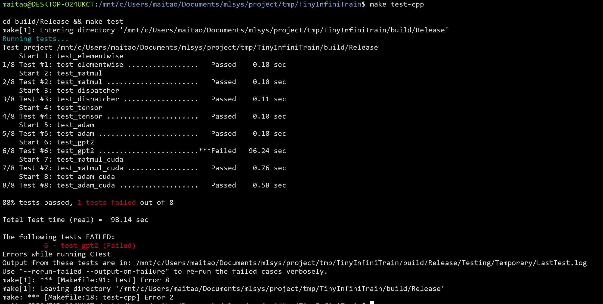
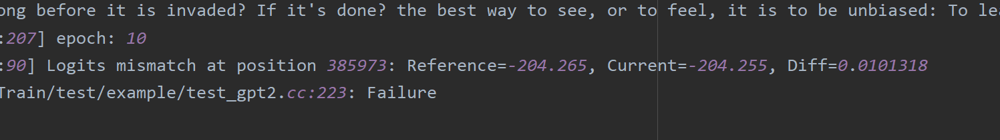

# TinyInfiniTrain 作业报告

## 一、test 通过截图






test_gpt2无法成功通过，Diff为0.01，暂时找不出原因

## 二、作业步骤

> 将代码填入下面代码块中指定位置，并详细描述完成该作业的解决思路和遇到的问题。

### 作业一：autograd机制调用Neg kernel的实现

难度：⭐

对应测例：`TEST(ElementwiseTest, NegForward)`，`TEST(ElementwiseTest, NegBackward)`

需要实现的代码块位置：`infini_train/src/autograd/elementwise.cc`

```c++
std::vector<std::shared_ptr<Tensor>> Neg::Forward(const std::vector<std::shared_ptr<Tensor>> &input_tensors) {
    // =================================== 作业 ===================================
    // TODO：通过Dispatcher获取设备专属kernel，对输入张量进行取反操作
    // HINT: 依赖test_dispatcher，kernel实现已给出
    // =================================== 作业 ===================================
    CHECK_EQ(input_tensors.size(), 1);
    const auto &input = input_tensors[0];

    auto device = input->GetDevice().Type();
    auto kernel = Dispatcher::Instance().GetKernel({device, "NegForward"});
    return {kernel.Call<std::shared_ptr<Tensor>>(input)};
}

std::vector<std::shared_ptr<Tensor>> Neg::Backward(const std::vector<std::shared_ptr<Tensor>> &grad_outputs) {
    // =================================== 作业 ===================================
    // TODO：通过Dispatcher获取设备专属的反向传播kernel，计算梯度
    // HINT: 依赖test_dispatcher，kernel实现已给出
    // =================================== 作业 ===================================
    CHECK_EQ(grad_outputs.size(), 1);
    const auto &grad_output = grad_outputs[0];

    auto device = grad_output->GetDevice().Type();
    auto kernel = Dispatcher::Instance().GetKernel({device, "NegBackward"});
    return {kernel.Call<std::shared_ptr<Tensor>>(grad_output)};
}
```

#### 解决思路

Neg是单输入函数，则1个input，Forward按其他函数一样调用kernel.Call就行

Neg函数的导数稳定为-1，不需要context，Backward也直接call就行

#### 遇到问题

把代码整体结构看完就比较简单了

### 作业二：实现矩阵乘法

难度：⭐⭐

#### CPU实现

对应测例：`TEST(MatmulTest, BasicMatrixMultiply)`，`TEST(MatmulTest, BatchedMatrixMultiply)`, `TEST(MatmulTest, BackwardPass)`

需要实现的代码块位置：`infini_train/src/kernels/cpu/linear.cc`

```c++
    std::shared_ptr<Tensor> MatmulForward(const std::shared_ptr<Tensor> &input, const std::shared_ptr<Tensor> &other) {
        // =================================== 作业 ===================================
        // TODO：实现CPU上的矩阵乘法前向计算
        // REF:
        // =================================== 作业 ===================================
        const auto &input_dims = input->Dims();
    const auto &other_dims = other->Dims();

    CHECK_GE(input_dims.size(), 2);
    CHECK_GE(other_dims.size(), 2);
    CHECK_EQ(input_dims.back(), *(other_dims.rbegin() + 1));

    // ..axb ..bxc
    const auto a = *(input_dims.rbegin() + 1), b = input_dims.back(), c = other_dims.back();
    auto output_dims = std::vector<int64_t>(input_dims);
    *(output_dims.rbegin() + 1) = a;
    *(output_dims.rbegin()) = c;
    auto output = std::make_shared<Tensor>(output_dims, DataType::kFLOAT32);

    int64_t size = 1;
    for (int i = 0; i < input_dims.size() - 2; ++i) {
        CHECK_EQ(input_dims[i], other_dims[i]);
        size *= input_dims[i];
    }

    // 矩阵乘法
    for (int i = 0; i < size; ++i) {
        int offset1 = i * a * b;
        int offset2 = i * b * c;
        int offset3 = i * a * c;
        for (int j = 0; j < a; ++j) {
            for (int k = 0; k < c; ++k) {
                float sum = 0;
                for (int l = 0; l < b; ++l) {
                    sum += static_cast<const float *>(input->DataPtr())[offset1 + j * b + l] *
                        static_cast<const float *>(other->DataPtr())[offset2 + l * c + k];
                }
                static_cast<float *>(output->DataPtr())[offset3 + j * c + k] = sum;
            }
        }
    }

    return {output};
    }

    std::tuple<std::shared_ptr<Tensor>, std::shared_ptr<Tensor>>
        MatmulBackward(const std::shared_ptr<Tensor> &input, const std::shared_ptr<Tensor> &other,
                    const std::shared_ptr<Tensor> &grad_output) {
        // =================================== 作业 ===================================
        // TODO：实现CPU上的矩阵乘法反向传播
        // REF:
        // =================================== 作业 ===================================
        const auto &input_dims = input->Dims();
    const auto &other_dims = other->Dims();
    const auto &output_dims = grad_output->Dims();
    CHECK_GE(input_dims.size(), 2);
    CHECK_GE(other_dims.size(), 2);
    CHECK_GE(output_dims.size(), 2);


    auto grad_input = std::make_shared<Tensor>(input_dims, DataType::kFLOAT32);
    auto grad_other = std::make_shared<Tensor>(other_dims, DataType::kFLOAT32);

    // ..axb ..bxc
    const auto a = *(input_dims.rbegin() + 1), b = input_dims.back(), c = other_dims.back();

    int64_t size = 1;
    for (int i = 0; i < input_dims.size() - 2; ++i) {
        CHECK_EQ(input_dims[i], other_dims[i]);
        size *= input_dims[i];
    }

    /*
     * 二维时
     * grad_input = grad_output * other^T
     * grad_other = input^T * grad_output;
     * 多维类似，注意细节
     */
    for (int i = 0; i < size; ++i) {
        int offset1 = i * a * b;
        int offset2 = i * b * c;
        int offset3 = i * a * c;

        // grad_input = grad_output * other^T
        // axc cxb
        for (int j = 0; j < a; ++j) {
            for (int k = 0; k < b; ++k) {
                float sum_input = 0;
                for (int l = 0; l < c; ++l) {
                    sum_input += static_cast<const float *>(grad_output->DataPtr())[offset3 + j * c + l] *
                        static_cast<const float *>(other->DataPtr())[offset2 + k * c + l];
                }
                static_cast<float *>(grad_input->DataPtr())[offset1 + j * b + k] = sum_input;
            }
        }
        // grad_other = input^T * grad_output;
        // bxa axc
        for (int j = 0; j < b; ++j) {
            for (int k = 0; k < c; ++k) {
                float sum_other = 0;
                for (int l = 0; l < a; ++l) {
                    sum_other += static_cast<const float *>(input->DataPtr())[offset1 + l * b + j] *
                        static_cast<const float *>(grad_output->DataPtr())[offset3 + l * c + k];
                }
                static_cast<float *>(grad_other->DataPtr())[offset2 + j * c + k] = sum_other;
            }
        }
    }

    return {grad_input, grad_other};
}
```

#### CUDA实现

对应测例：`TEST(MatmulTest, BasicMatrixMultiplyCuda)`,`TEST(MatmulTest, BatchedMatrixMultiplyCuda)`,`TEST(MatmulTest, BackwardPassCuda)`

需要实现的代码块位置：`infini_train/src/kernels/cuda/linear.cu`

```c++
    std::shared_ptr<Tensor> MatmulForward(const std::shared_ptr<Tensor> &input, const std::shared_ptr<Tensor> &other) {
        // =================================== 作业 ===================================
        // TODO：实现CUDA上的矩阵乘法前向计算
        // REF:
        // =================================== 作业 ===================================
    }
	const auto &input_dims = input->Dims();
    const auto &other_dims = other->Dims();
    CHECK_GE(input_dims.size(), 2);
    CHECK_GE(other_dims.size(), 2);

    const int64_t M1 = input_dims[input_dims.size() - 2];
    const int64_t N1 = input_dims[input_dims.size() - 1];
    const int64_t M2 = other_dims[other_dims.size() - 2];
    const int64_t N2 = other_dims[other_dims.size() - 1];

    // M1 x N1 * M2 x N2 --> M1 x N2
    CHECK(N1 == M2);

    const int64_t size = std::accumulate(input_dims.rbegin() + 2, input_dims.rend(), 1, std::multiplies<int64_t>{});

    auto output_dims = input_dims;
    output_dims[output_dims.size() - 1] = N2;
    auto output = std::make_shared<Tensor>(output_dims, DataType::kFLOAT32, input->GetDevice());
    output->Fill<float>(0.0f);

    const float alpha = 1.0f;
    const float beta = 0.0f;
    std::vector<cudaStream_t> streams(size);
    std::vector<cublasHandle_t> handles(size);

    for (int i = 0; i < size; ++i) {
        CUDA_CHECK(cudaStreamCreate(&streams[i]));
        CUBLAS_CHECK(cublasCreate(&handles[i]));
        CUBLAS_CHECK(cublasSetStream(handles[i], streams[i]));

        // output = input * other --> output.T = other.T * input.T
        // C = output.T[N2, M1]
        // A = other.T[N2, M2]
        // B = input.T[N1, M1]
        CUBLAS_CHECK(cublasSgemm(handles[i], CUBLAS_OP_N, CUBLAS_OP_N, N2, M1, N1, &alpha,
            static_cast<const float *>(other->DataPtr()) + i * N2 * M2, N2,
            static_cast<const float *>(input->DataPtr()) + i * N1 * M1, N1,
            &beta, static_cast<float *>(output->DataPtr()) + i * N2 * M1, N2));
    }
    // 等待所有 stream 完成
    cudaDeviceSynchronize();

    // 清理资源
    for (int i = 0; i < size; ++i) {
        CUBLAS_CHECK(cublasDestroy(handles[i]));
        cudaStreamDestroy(streams[i]);
    }
    return output;

    std::tuple<std::shared_ptr<Tensor>, std::shared_ptr<Tensor>>
        MatmulBackward(const std::shared_ptr<Tensor> &input, const std::shared_ptr<Tensor> &other,
                    const std::shared_ptr<Tensor> &grad_output) {
        // =================================== 作业 ===================================
        // TODO：实现CUDA上的矩阵乘法反向传播
        // REF:
        // =================================== 作业 ===================================
    const auto &input_dims = input->Dims();
    const auto &other_dims = other->Dims();
    CHECK_GE(input_dims.size(), 2);
    CHECK_GE(other_dims.size(), 2);

    auto grad_input = std::make_shared<Tensor>(input_dims, DataType::kFLOAT32, input->GetDevice());
    auto grad_other = std::make_shared<Tensor>(other_dims, DataType::kFLOAT32, other->GetDevice());
    grad_input->Fill<float>(0.0f);
    grad_other->Fill<float>(0.0f);

    const int64_t M = input_dims[input_dims.size() - 2];
    const int64_t K = input_dims[input_dims.size() - 1];
    const int64_t N = other_dims[other_dims.size() - 1];

    // M x K * K x N --> M x N
    CHECK(K == other_dims[other_dims.size() - 2]);

    const int64_t size = std::accumulate(input_dims.rbegin() + 2, input_dims.rend(), 1, std::multiplies<int64_t>{});

    const float alpha = 1.0f;
    const float beta = 0.0f;
    std::vector<cudaStream_t> streams(size);
    std::vector<cublasHandle_t> handles(size);

    for (int i = 0; i < size; ++i) {
        CUDA_CHECK(cudaStreamCreate(&streams[i]));
        CUBLAS_CHECK(cublasCreate(&handles[i]));
        CUBLAS_CHECK(cublasSetStream(handles[i], streams[i]));

        // grad_input = grad_output * other.T
        // grad_input.T = other * grad_output.T
        // C = grad_input.T[K, M]
        // A = other.T[N, K]
        // B = grad_output.T[N, M]

        CUBLAS_CHECK(cublasSgemm(handles[i], CUBLAS_OP_T, CUBLAS_OP_N, K, M, N, &alpha,
            static_cast<const float *>(other->DataPtr()) + i * N * K, N,
            static_cast<const float *>(grad_output->DataPtr()) + i * N * M, N,
            &beta, static_cast<float *>(grad_input->DataPtr()) + i * K * M, K));

        // grad_other = input.T * grad_output
        // grad_other.T = grad_output.T * input
        // C = grad_other.T[N, K]
        // A = grad_output.T[N, M]
        // B = input.T[K, M]
       CUBLAS_CHECK(cublasSgemm(handles[i], CUBLAS_OP_N, CUBLAS_OP_T, N, K, M, &alpha,
            static_cast<const float *>(grad_output->DataPtr()) + i * N * M, N,
            static_cast<const float *>(input->DataPtr()) + i * K * M, K,
            &beta, static_cast<float *>(grad_other->DataPtr()) + i * N * K, N));
    }
    // 等待所有 stream 完成
    cudaDeviceSynchronize();

    // 清理资源
    for (int i = 0; i < size; ++i) {
        CUBLAS_CHECK(cublasDestroy(handles[i]));
        cudaStreamDestroy(streams[i]);
    }

    return {grad_input, grad_other};
    }
```

#### 解决思路

阅读了下面的linear forward以及backward代码，对forward和backward更了解了，forward就是计算，backward就是**求偏导**

如果维度等于2，则forward直接乘就行，backward的话，就是函数链式求导，自己推导理解了之后，只需记住维度对准（方便记忆）就可以了，比如input[a,  b], other[b, c]，output[a, c]。那么$input\_grad=output\_grad*other^T$...

其他：根据测试用例以及参考文档，维度可以大于2，则[..., a, b] * [..., b, c] = [..., a, c]

CUDA编程方面

1. cuda是按列主序的，比较绕，参考下面的linearforward，先全部变成转置状态，确定乘数顺序，然后填好维度，最后再考虑是否CUBLAS_OP_T
2. 根据AI提示，使用了stream来增加并行度，暂时还没了解这样是否优雅

#### 遇到问题

- [x] ~~backward推导~~
- [x] ~~cuda编程~~
- [ ] 根据文档，应该可以矩阵乘法广播，但是还没实现，虽然能通过测试..

### 作业三：实现Adam优化器

难度：⭐

#### CPU实现

对应测例：`TEST(AdamOptimizerTest, BasicParameterUpdate)`,`TEST(AdamOptimizerTest, MomentumAccumulation)`

代码位置：infini_train/src/kernels/cpu/accumulate_grad.cc

```c++
void AdamAccumulateGrad(const std::shared_ptr<Tensor> &grad, const std::shared_ptr<Tensor> &param,
                        const std::shared_ptr<Tensor> &m, const std::shared_ptr<Tensor> &v, float learning_rate,
                        float beta1, float beta2, float eps, int64_t t) {
    // =================================== 作业 ===================================
    // TODO：实现Adam优化器的梯度累积和参数更新
    // REF: 
    // =================================== 作业 ===================================
    float beta1_pow = std::pow(beta1, t);
    float beta2_pow = std::pow(beta2, t);

    for (int64_t idx = 0; idx < grad->NumElements(); ++idx) {
        auto L = static_cast<const float *>(grad->DataPtr())[idx];
        auto &mm = static_cast<float *>(m->DataPtr())[idx];
        auto &vv = static_cast<float *>(v->DataPtr())[idx];
        mm = beta1 * mm + (1 - beta1) * L;
        vv = beta2 * vv + (1 - beta2) * L * L;
        float m_hat = mm / (1 - beta1_pow);
        float v_hat = vv / (1 - beta2_pow);
        static_cast<float *>(param->DataPtr())[idx] -= learning_rate * m_hat / std::sqrt(v_hat + eps);
    }
}
```

#### CUDA实现

对应测例：`TEST(AdamOptimizerTest, BasicParameterUpdateCuda)`,`TEST(AdamOptimizerTest, MomentumAccumulationCuda)`

代码位置：infini_train/src/kernels/cuda/accumulate_grad.cu

```c++
__global__ void AdamAccumulateGradKernel(const float *grad_ptr, float *param, float *m, float *v, float learning_rate,
                    float beta1,float beta2, float beta1_pow, float beta2_pow, float eps, size_t num_elements) {
    int idx = blockIdx.x * blockDim.x + threadIdx.x;
    if (idx < num_elements) {
        float L = grad_ptr[idx];
        m[idx] = beta1 * m[idx] + (1 - beta1) * L;
        v[idx] = beta2 * v[idx] + (1 - beta2) * L * L;
        float m_hat = m[idx] / (1 - beta1_pow);
        float v_hat = v[idx] / (1 - beta2_pow);
        param[idx] -= learning_rate * m_hat / sqrtf(v_hat + eps);
    }
}

void AdamAccumulateGrad(const std::shared_ptr<Tensor> &grad, const std::shared_ptr<Tensor> &param,
                        const std::shared_ptr<Tensor> &m, const std::shared_ptr<Tensor> &v, float learning_rate,
                        float beta1, float beta2, float eps, int64_t t) {
    // =================================== 作业 ===================================
    // TODO：实现Adam优化器的梯度累积和参数更新
    // REF: 
    // =================================== 作业 ===================================
    size_t num_elements = grad->NumElements();
    float beta1_pow = std::pow(beta1, t);
    float beta2_pow = std::pow(beta2, t);

    const float *grad_ptr = static_cast<const float *>(grad->DataPtr());
    float *param_ptr = static_cast<float *>(param->DataPtr());
    float *m_ptr = static_cast<float *>(m->DataPtr());
    float *v_ptr = static_cast<float *>(v->DataPtr());

    int threads_per_block = 256;
    int num_blocks = (num_elements + threads_per_block - 1) / threads_per_block;

    AdamAccumulateGradKernel<<<num_blocks, threads_per_block>>>(grad_ptr, param_ptr, m_ptr, v_ptr, learning_rate,
         beta1, beta2, beta1_pow, beta2_pow, eps, num_elements);
}
```

#### 解决思路

按照公式写就行，比较简单

cuda编写时，beta的pow操作可以先算再传进去并行计算

#### 遇到问题

SGD传入的学习率是负数，调整参数是增加，而Adam传入的是正数，调整参数是相减，不够优雅。


### 作业四：实现Tensor基础操作

#### 实现Tensor的Flatten操作

难度：⭐

对应测例：`TEST(TensorTransformTest, Flatten2DTo1D)`,`TEST(TensorTransformTest, FlattenWithRange) `,`TEST(TensorTransformTest, FlattenNonContiguous)`

代码位置：infini_train/src/tensor.cc

```c++
std::shared_ptr<Tensor> Tensor::Flatten(int64_t start, int64_t end) {
    // =================================== 作业 ===================================
    // TODO：实现张量扁平化操作，将指定维度范围[start, end]内的所有维度合并为一个维度
    // HINT: 
    // =================================== 作业 ===================================
    if (end < 0) {
        end += dims_.size();
    }
	// 新维度大小
    const int dim = dims_.size() + start - end;
    std::vector<int64_t> new_shape(dim);

    for (int i = 0; i < dim; i++) {
        if (i == start) {
            // 中间维度累乘变成一个维度
            new_shape[i] = std::accumulate(dims_.begin() + start, dims_.begin() + end + 1, 1, std::multiplies<int64_t>{});
        } else {
            // 其余复制就行
            new_shape[i] = dims_[i];
        }
    }

    return Contiguous()->View(new_shape);
}
```

#### 实现Tensor的反向传播机制

难度：⭐

对应测例：`TEST(TensorAutogradTest, BackwardComputesGradient)`,`TEST(TensorAutogradTest, BackwardWithMultipleOutputs)`

代码位置：infini_train/src/tensor.cc

```c++
void Tensor::Backward(std::shared_ptr<Tensor> gradient, bool retain_graph, bool create_graph) const {
    // =================================== 作业 ===================================
    // TODO：实现自动微分反向传播
    // 功能描述：1. 计算当前张量对叶子节点的梯度    2. 支持多输出场景的梯度累加
    // HINT: 
    // =================================== 作业 ===================================
    if (grad_fn_) {
        // gradient不传时默认为nullptr，这是要手动初始化，自己对自己的导数为1
        if (!gradient) {
            gradient = std::make_shared<Tensor>(dims_, dtype_, GetDevice());
            gradient->Fill<float>(1.0f);
        }
        grad_fn()->BackwardPartial(gradient, output_idx_);
    }
}
```

#### 解决思路

难点在于要看许多代码了解整个流程

简述一下计算图的运行流程：

执行计算时，会创建一个function对象，对输入tensor进行forward计算，然后中间值用于反向传播。并指向输入tensor的grad_fn，如果输入tensor是叶子，则指向AccumulateGrad，反向传播时给叶子累计梯度；初始化grad_output、output_tensor等属性。

对tensor调用backward后，会调用其grad_fn的BackwardPartial，由于一个函数可以有多个输出，只有当多个父节点的梯度都累计完后，才将梯度传给子节点，最后会传到叶子节点，执行AccumulateGrad函数。

#### 遇到问题


### 作业五 注册算子kernel的实现

难度：⭐⭐⭐

对应测例：`TEST(DispatcherTest, RegisterAndGetKernel)`,`TEST(DispatcherTest, DuplicateRegistration)`,`TEST(DispatcherTest, GetNonexistentKernel)`

代码位置：infini_train/include/dispatcher.h

```c++
template <typename RetT, class... ArgsT> RetT Call(ArgsT... args) const {
    // =================================== 作业 ===================================
    // TODO：实现通用kernel调用接口
    // 功能描述：将存储的函数指针转换为指定类型并调用
    // HINT: 
    // =================================== 作业 ===================================
    using FuncT = RetT (*)(ArgsT...);
    return reinterpret_cast<FuncT>(func_ptr_)(args...);
}

template <typename FuncT> void Register(const KeyT &key, FuncT &&kernel) {
    // =================================== 作业 ===================================
    // TODO：实现kernel注册机制
    // 功能描述：将kernel函数与设备类型、名称绑定
    // =================================== 作业 ===================================
    
    CHECK(!key_to_kernel_map_.contains(key))
            << "Kernel already registered: " << key.second << " on device: " << static_cast<int>(key.first);

    // key_to_kernel_map_.insert({key, KernelFunction(std::forward<FuncT>(kernel))});
    key_to_kernel_map_.emplace(key, kernel);
}

#define REGISTER_KERNEL(device, kernel_name, kernel_func) \
    // =================================== 作业 ===================================
    // TODO：实现自动注册宏
    // 功能描述：在全局静态区注册kernel，避免显式初始化代码
    // =================================== 作业 ===================================
const static bool _## kernel_name## __COUNTER__ = [](){\
        infini_train::Dispatcher::Instance().Register({device, #kernel_name}, kernel_func);    \
        return true;\
}();
```

#### 解决思路

Call函数：成员变量存的是void*，直接强转然后调用就行。 学会了变长参数的使用方法。

Register函数：一开始用的是key_to_kernel_map_.insert({key, kernel})，报错了，因为kernel不能自动转成KernelFunction类型。后来参考了InfiniTrain，对emplace函数了解更多了，emplace的原理是传参数进去原地构造。

宏：该宏放在全局空间上，只能使用静态变量，C++程序运行前会初始化静态变量。可以考虑建一个类，在类的构造函数中执行函数，这样创建一个对象就可以注册了。后来参考了InfiniTrain，使用匿名函数并调用的方法更优雅。

心得：增加一个中间层，这样call就能根据Device不同而执行不同的函数，使用对应的设备进行计算

#### 遇到问题


### 作业六：实现GPT-2整体训练

难度：⭐⭐⭐⭐

对应测例：`TEST_F(GPT2TrainingTest, LogitsConsistency)`

#### 训练过程logits对比

完成以上所有作业，补齐训练框架的所有实现，理论上`TEST_F(GPT2TrainingTest, LogitsConsistency)`可以通过，在用例中判断比较预置的值和单步正向传播计算结果是否在误差允许范围内相等。

#### 数据读取实现

代码位置：example/common/tiny_shakespeare_dataset.cc

```c++
TinyShakespeareFile ReadTinyShakespeareFile(const std::string &path, size_t sequence_length) {
    /* =================================== 作业 ===================================
       TODO：实现二进制数据集文件解析
       文件格式说明：
    ----------------------------------------------------------------------------------
    | HEADER (1024 bytes)                     | DATA (tokens)                        |
    | magic(4B) | version(4B) | num_toks(4B) | reserved(1012B) | token数据           |
    ----------------------------------------------------------------------------------
       =================================== 作业 =================================== */
    std::ifstream ifs(path, std::ios::binary);
    CHECK(ifs.is_open()) << "文件打开失败: " << path;

    auto header = ReadSeveralBytesFromIfstream(1024, &ifs);
    int magic = BytesToType<int>(header, 0); // ?
    int version = BytesToType<int>(header, 4);
    int num_toks = BytesToType<int>(header, 8);

    auto it = kTypeMap.find(magic);
    CHECK(it != kTypeMap.end()) << "不支持的文件版本: " << version;
    auto tok_type = it->second;
    auto tok_size = kTypeToSize.at(tok_type);
    auto dtype = kTypeToDataType.at(tok_type);
    auto token_bytes = ReadSeveralBytesFromIfstream(num_toks * tok_size, &ifs);
    // 计算样本数
    size_t num_samples = num_toks / sequence_length;
    std::vector<int64_t> dims = {static_cast<int64_t>(num_samples), static_cast<int64_t>(sequence_length)};
    // 构造 tensor

    TinyShakespeareFile file;
    file.dims = dims;
    file.type = tok_type;
    file.tensor = infini_train::Tensor(dims, DataType::kINT64); // 不是kINT64会报错
    for (int i = 0; i < num_samples * sequence_length; i++) {
        int64_t val = 0;
        if (tok_type == TinyShakespeareType::kUINT16) {
            val = static_cast<int64_t>(BytesToType<uint16_t>(token_bytes, i * tok_size));
        } else if (tok_type == TinyShakespeareType::kUINT32) {
            val = static_cast<int64_t>(BytesToType<uint32_t>(token_bytes, i * tok_size));
        }
        std::memcpy(static_cast<int64_t *>(file.tensor.DataPtr()) + i, &val, sizeof(int64_t));
    }
}

TinyShakespeareDataset::TinyShakespeareDataset(const std::string &filepath, size_t sequence_length)
    : text_file_(ReadTinyShakespeareFile(filepath, sequence_length)), sequence_length_(sequence_length),
      sequence_size_in_bytes_(sequence_length * sizeof(int64_t)), num_samples_(text_file_.dims[0] - 1) {
          // const变量，只能列表初始化
}
```

#### Tokenizer功能实现

代码位置：example/common/tokenizer.cc

```c++
Tokenizer::Tokenizer(const std::string &filepath) {
    /* ===================================== 作业 =====================================
    TODO：实现Tokenizer二进制文件加载

    文件格式说明：
    ----------------------------------------------------------------------------------
    | HEADER (1024 bytes)                     | VOCAB TABLE                           |
    | magic(4B) | version(4B) | vocab_size(4B) | reserved(1012B) | token词表数据       |
    ----------------------------------------------------------------------------------
    ===================================== 作业 ===================================== */
    std::ifstream ifs(filepath, std::ios::binary);
     CHECK(ifs.is_open()) << "文件打开失败: " << filepath;

     auto header = ReadSeveralBytesFromIfstream(1024, &ifs);
     magic_number_ = BytesToType<uint32_t>(header, 0);
     Version version = BytesToType<Version>(header, 4);
     vocab_size_ = BytesToType<uint32_t>(header, 8);

     if (version == Version::kV1) {
         eot_token_ = kEotMap.at(magic_number_);
     } else if (version == Version::kV2) {
         eot_token_ = BytesToType<uint32_t>(header, 12);
     } else {
         LOG(FATAL) << "不支持的文件版本: " << static_cast<uint32_t>(version);
         return;
     }

     token_table_.resize(vocab_size_);
     // 第一个字节代表token长度，后续字节为token内容
     for (uint32_t i = 0; i < vocab_size_; ++i) {
         uint8_t token_len = ReadSeveralBytesFromIfstream(1, &ifs)[0];
         auto token_bytes = ReadSeveralBytesFromIfstream(token_len, &ifs);
         token_table_[i] = std::string(token_bytes.begin(), token_bytes.end());
     }
}
```

```c++
std::string Tokenizer::Decode(uint32_t token_id) const {
    /* ===================================== 作业 =====================================
    TODO：实现token_id到文本的转换
    功能描述：根据token_id返回对应的文本片段
    ===================================== 作业 ===================================== */
    if (token_id >= vocab_size_) {
        return "[INVALID_TOKEN]";
    }
    return token_table_[token_id];
}
```

```c++
void Tokenizer::GenerateText(infini_train::nn::Module &model, uint32_t batch_size, uint32_t sequence_length,
                             uint32_t text_length, Device device) const {
    /* ...原代码... */
    LOG(INFO) << "start generate text:";
    for (int t = prompt_len; t < text_length; t++) {
        /* ===================================== 作业 =====================================
        TODO：实现单步文本生成逻辑
        HINT：调用model.Forward推理获取logits，根据推理结果进行随机采样，调用Decode获取文本结果
        ===================================== 作业 ===================================== */
      	auto input_tensor = std::make_shared<infini_train::Tensor>(x->To(device)); // 从CPU转到计算设备
        auto model_output = model.Forward({input_tensor})[0];
        auto probabilities_tensor = nn::function::Softmax(model_output, -1);
        auto probabilities_cpu = probabilities_tensor->To(Device());
        auto raw_data = probabilities_cpu.DataPtr();
        auto vocabulary_size = model_output->Dims()[2];
        float *prob_distribution = static_cast<float *>(raw_data) + t * vocabulary_size;
        float random_value = RandomF32(kRngState);
        int predicted_token = SampleMult(prob_distribution, vocabulary_size, random_value);

        input_tensor = std::make_shared<infini_train::Tensor>(input_tensor->To(Device())); // 从计算设备转回CPU
        auto tensor_data = static_cast<int64_t *>(input_tensor->DataPtr());
        tensor_data[t] = predicted_token;
        std::cout << Decode(predicted_token);
    }
    
    std::cout << std::endl;
}
```

#### 解决思路

SampleMult是个几何概型，通过softmax求出概率后，将其分布在[0,1]上，再抛硬币决定选哪个。因为不一定要选概率最大的那个，这样造句可以更加灵活。


#### 遇到问题

1. 感觉提示很少，比如ReadTinyShakespeareFile的file.tensor数据类型为kINT64，不然会报错，被kTypeToDataType误导了。
2. tokenizer的Version::kV1没说有啥用，不得不参考一下InfiniTrain
3. 一开始没有了解数据是什么格式存的，后来才知道dataset是固定字节，tokenizer词表数据是长度+字符串。十分合理，只需要一个词表，多个dataset使用token_id表示单词就很便捷。
4. GPU数据不能直接访问，debug了很久才发现
5. 整个流程还不够熟悉，需要充分时间多读代码
6. **不知道哪里出错，测试无法通过，误差不大**

# 总结

直接看代码是学习最快的方式，通过这个tiny project，让我对训练系统有所了解，并对其他方向产生了兴趣，比如CUDA、infinitensor等等。并且看代码的过程中，也能学到很多C++的编程知识，希望以后能把这些project的代码都看懂，对AI系统了解更多。
